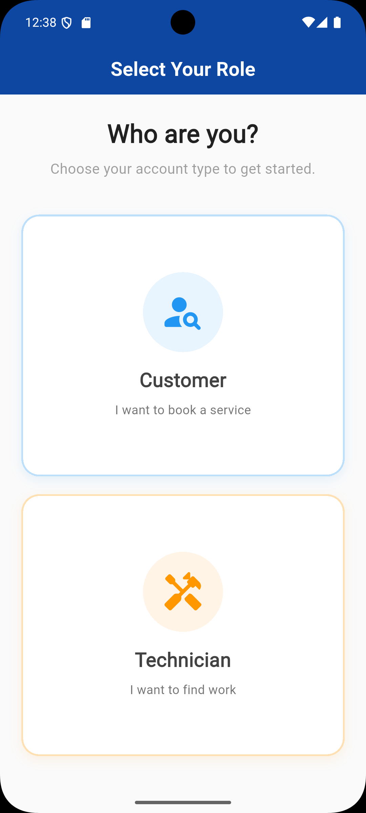

# ON TIME FIX

**ON TIME FIX** is a full‑stack mobile service‑booking application designed to connect customers with verified local technicians in real time. The platform focuses on **speed, reliability, and transparency**, enabling users to book services quickly while giving technicians a structured workflow to manage, accept, and complete jobs efficiently.

This project was **independently designed, developed, and implemented** by **Shaik Sydavali** as a personal product‑driven initiative, with a strong emphasis on real‑world usability, clean UI/UX, and scalable architecture.

---

## 🚀 Key Highlights

* End‑to‑end service booking workflow (Customer ↔ Technician)
* Dual‑role architecture with role‑specific dashboards
* Real‑time job lifecycle tracking (Pending → In‑Progress → Completed)
* Priority‑based job handling (Normal / Urgent)
* Technician discovery with ratings & experience
* Polished, production‑grade UI focused on usability

---

## 🧠 Problem Statement

Finding reliable technicians for home services is often time‑consuming and uncertain. Customers struggle with availability, response time, and trust, while technicians lack a structured system to receive and manage work.

**ON TIME FIX** solves this by acting as a unified platform where:

* Customers can quickly request services and track job progress
* Technicians receive structured job requests and manage their work pipeline
* Trust is reinforced through verification, ratings, and transparent status updates

---

## 🛠️ Features

### 👤 Authentication & Onboarding

* Secure login & signup
* Role selection (Customer / Technician)
* Profile completion flows for both roles
* Password recovery support

### 🧍 Customer Features

* Browse and select service categories
* View available technicians with ratings & experience
* Book services with location, problem details, and urgency level
* Track bookings (Pending / In‑Progress / Completed)
* Rate and review technicians after job completion

### 🛠️ Technician Features

* Dedicated dashboard with job states (Pending, In‑Progress, History)
* Accept or decline job requests
* View customer details and service requirements
* Mark jobs as completed
* Maintain service skills and experience profile

### 📊 Job Lifecycle Management

* Pending request handling
* Real‑time job status updates
* Confirmation workflows for job completion
* Historical job tracking

---

## 📱 Screenshots

> Below is a curated walkthrough of the application’s core flows and UI screens.

### 🔐 Authentication & Onboarding

* Splash Screen
* Role Selection (Customer / Technician) 

  

* Login
* Sign Up
* Forgot Password

### 👥 Customer Flow

* Customer Home (Service Categories)
* Technician List
* Booking Form
* My Bookings (Pending / In‑Progress / Completed)
* Job Completion Confirmation
* Rating & Feedback Screen

### 🧰 Technician Flow

* Technician Dashboard (Pending / In‑Progress / History)
* Accept / Decline Job
* Active Job View
* Job Completion Flow
* Technician Profile Setup

*(Screenshots included in the repository for full visual reference)*

---

## 🧩 Architecture Overview

The application is structured around clear separation of concerns:

* **Presentation Layer**: Clean, modular UI components with consistent design language
* **Business Logic Layer**: Handles role‑based workflows, job states, and validations
* **Data Layer**: Manages user profiles, bookings, job status, and ratings

This architecture ensures scalability, maintainability, and clarity across features.

---

## ⚙️ Tech Stack

* **Frontend**: Flutter
* **State Management**: Provider / SetState (as applicable)
* **Backend**: Firebase (Authentication, Database)
* **Design**: Custom UI components with Material Design principles

---

## 📌 Use Cases

* On‑demand home services (cleaning, plumbing, electrical, AC repair, etc.)
* Local technician discovery platforms
* Service marketplace MVPs
* Real‑time task assignment systems

---

## 🔮 Future Enhancements

* Real‑time chat between customer and technician
* Live location tracking during active jobs
* Payment gateway integration
* Admin dashboard for verification & moderation
* Push notifications for job updates
* AI‑based technician recommendation system
* Multi‑language support

---

## 👨‍💻 Developer

**Shaik Sydavali**
Mobile Application Developer

* Passionate about building real‑world, user‑centric applications
* Focused on clean architecture, UX quality, and scalable systems

---

## 📄 License

This project is open for learning and demonstration purposes. Licensing can be added based on future open‑source or commercial direction.

---

⭐ If you find this project interesting or valuable, feel free to star the repository and share feedback.
